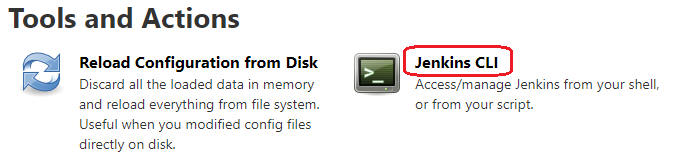

# Using Jenkins CLI

### Launch CLI instance

(1) From your jenkins installation UI homepage, navigate to: \
`Manage Jenkins` --> `Jenkins CLI`

Direct URL to CLI screen: `http://<host>:<port>/cli/`

(2) From the `Jenkins CLI` page, click to download the `jenkins-cli.jar`. \
Direct URL : `http://<host>:<port>/jnlpJars/jenkins-cli.jar`

(3) Once downloaded, open the command/terminal, and go to the directory where this `.jar` file is accessible. \
**Note:** Java (JRE) should be installed locally. \

Use the following template to run Jenkins-CLI commands. \
`C:\folder> java -jar jenkins-cli.jar -s http://<host>:<port>/ -webSocket -auth <user>:<password> <command>`

## CLI commands:

* `help` - Lists all the available commands or a detailed description of single command. \
*Example*: `C:\folder> java -jar jenkins-cli.jar -s http://<host>:<port>/ -webSocket -auth <user>:<password> help`

* `list-jobs` - Lists all the jobs/pipelines configured in Jenkins. \
*Example*: `C:\folder> java -jar jenkins-cli.jar -s http://<host>:<port>/ -webSocket -auth <user>:<password> list-jobs`

* `get-job JOB` - Dumps the job-definition of the job named "JOB" in XML to stdout.
*Example*: `C:\folder> java -jar jenkins-cli.jar -s http://<host>:<port>/ -webSocket -auth <user>:<password> get-job "job-name"`