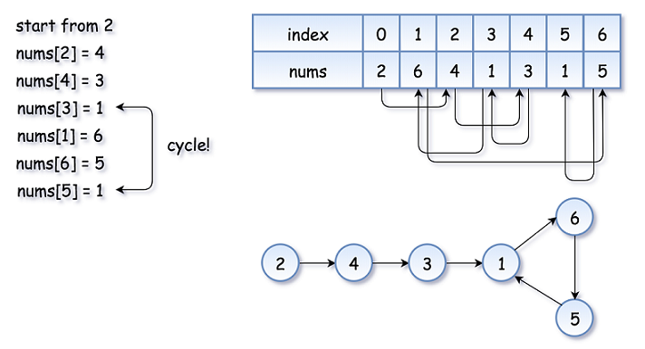
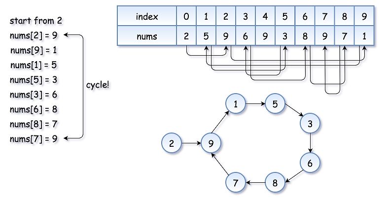
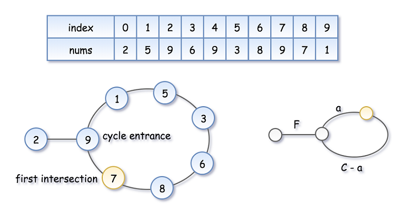
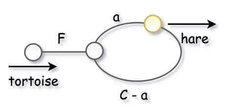
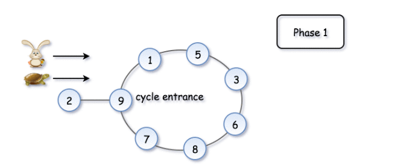

# Problem: Find the Duplicate Number

We'll reduce this problem into *finding a cycle within a linked-list* as shown below.

## Overview of the problem:

Given an array nums containing `n+1` integers where each integer is between `1` and `n` (inclusive), prove that at least one duplicate number must exist. Assume that there is only one duplicate number, find the duplicate one.

**Example 1:**
```
Input: [1,3,4,2,2]
Output: 2
```
**Example 2:**
```
Input: [3,1,3,4,2]
Output: 3
```

**Note:**
1. You **must not** modify the array (assume the array is read only).
2. You must use only constant, `O(1)` extra space.
3. Your runtime complexity should be less than O(n<sup>2</sup>).
4. There is only one duplicate number in the array, but it could be repeated more than once.

## Proof
Proving that at least one duplicate must exist in `nums` is simple application of the *pigeonhole principle*. Here, each number in `nums` is a *"pigeon"* and each distinct number that can appear in `nums` is a *"pigeonhole"*. Because there are `n+1` numbers are `n` distinct possible numbers, the *pigeonhole principle* implies that at least one of the numbers is duplicated.

**Note**
The first two approaches mentioned below do not satisfy the constraints given in the prompt, but they are solutions that you might be likely to come up with during a technical interview. As an interviewer, I personally would not expect someone to come up with the cycle detection solution unless they have heard it before.

## Approach 1: Sorting

**Intuition** \
If the numbers are sorted, then any duplicate numbers will be adjacent in the sorted array.

**Algorithm** \
Given the intuition, the algorithm follows fairly simply. First, we sort the array, and then we compare each element to the previous element. Because there is exactly one duplicated element in the array, we know that the array is of at least length 2, and we can return the duplicate element as soon as we find it.

```
class Solution {
    public int findDuplicate(int[] nums) {
        Arrays.sort(nums);
        for (int i = 1; i < nums.length; i++) {
            if (nums[i] == nums[i-1]) {
                return nums[i];
            }
        }
        return -1;
    }
}
```

**Complexity Analysis**

* Time complexity : *O(nlgn)* \
The `sort` invocation costs *O(nlgn)* time in Python and Java, so it dominates the subsequent linear scan.

* Space complexity : *O(1)* (or *O(n)*) \
Here, we sort `nums` in place, so the memory footprint is constant. If we cannot modify the input array, then we must allocate linear space for a copy of `nums` and sort that instead.

## Approach 2: Set

**Intuition** \
If we store each element as we iterate over the array, we can simply check each element as we iterate over the array.

**Algorithm** \
In order to achieve linear time complexity, we need to be able to insert elements into a data structure (and look them up) in constant time. A `Set` satisfies these constraints nicely, so we iterate over the array and insert each element into `seen`. Before inserting it, we check whether it is already there. If it is, then we found our duplicate, so we return it.

```
class Solution {
    public int findDuplicate(int[] nums) {
        Set<Integer> seen = new HashSet<Integer>();
        for (int num : nums) {
            if (seen.contains(num)) {
                return num;
            }
            seen.add(num);
        }
        return -1;
    }
}
```

**Complexity Analysis** 

* Time complexity : *O(n)* \
`Set` in both Python and Java rely on underlying hash tables, so insertion and lookup have amortized constant time complexities. The algorithm is therefore linear, as it consists of a `for` loop that performs constant work `n` times.

* Space complexity : *O(n)* \
In the worst case, the duplicate element appears twice, with one of its appearances at array index `n−1`. In this case, seen will contain `n−1` distinct values, and will therefore occupy `O(n)` space.

## Approach 3: Floyd's Tortoise and Hare (Cycle Detection)

**Intuition** \
The idea is to reduce the problem to `"Linked List Cycle Detection"` (i.e. given a linked list, return the node where the cycle begins).

First of all, where does the cycle come from? Let's use the function `f(x) = nums[x]` to construct the sequence: `x, nums[x], nums[nums[x]], nums[nums[nums[x]]], ....`

Each new element in the sequence is an element in nums at the index of the *previous* element.

If one starts from `x = nums[0]`, such a sequence will produce a linked list with a cycle. The cycle appears because `nums` contains duplicates. The duplicate node is a cycle entrance.

Here is how it works:



The example above is simple because the loop is small. Here is a more interesting example with a bigger cycle:



Now the problem is to find the *entrance* of the cycle.

**Algorithm** \
Floyd's algorithm consists of two phases and uses two pointers, usually called `tortoise` and `hare`. It comparises of `"phase1"` to detect and cycle and `"phaze2"` to find the entry point to the cycle.

In **phase 1**, `hare = nums[nums[hare]]` is twice as fast as `tortoise = nums[tortoise]`. Since the `hare` goes fast, it would be the first one to enter the cycle and starts to run around the cycle. At some point, the `tortoise` enters the cycle as well, and since it's moving slower the `hare` catches the `tortoise` up at some *intersection point*. Now `phase-1` is over, and the `tortoise` has caught upto the `hare`.

**Note:** the intersection point is not the cycle entrance (general case scenario).



Here: \
`F` = distance of *cycle-entry point* from the begnning of the List. \
`C` = length of the *cycle*. \
`a` = distance from `F` (within `C`) where the `hare` intersected with the `tortoise`.

To compute the *intersection point*, let's note that the `hare` has traversed twice as many nodes as the `tortoise`. \
i.e. `2d(tortoise) = d(hare)`,

Since `d(tortoise) = F + a`, \
So, `d(hare) = 2(F + a)`         ... ... ...  EQ(1)

But the `hare` had to run around in circles before it intersected with the `tortoise`. \
Therefore, `d(hare) = F + nC + a` ... ... ...  EQ(2) \
Here `n` is some integer (`n>=1` i.e. atleast one cycle).


From EQ(1) and EQ(2): \
`2(F + a) = F + nC + a`

Hence the coordinate of the intersection point is `F + a = nC`. (The distance `F + a` is some multiple of the length of the Cycle `C`, i.e. `nC`).

In **phase 2**, we reset the tortoise back at the starting position. We keep the hare at its current position (interaction point) and slow it down, so that it now moves with the speed of tortoise. \
i.e.: `tortoise = nums[tortoise], hare = nums[hare]`

The `tortoise` is back at the starting position, and the `hare` starts from the intersection point (both will now move at the same speed).



Let's show that this time they meet at the cycle entrance after `F` steps.

* The `tortoise` started from zero, so its position after `F` steps is `F`.
* The `hare` started at the *intersection point* `F + a` (`= nC`). \
    So its position after `F` steps is `F + F + a` => `F + nC`. \
    That is the same point as `F`.
* So the `tortoise` and the (slowed down) `hare` will meet at the entrance of the cycle at point `F`.

**Implementation:**
```
class Solution {
  public int findDuplicate(int[] nums) {
    // Find the intersection point of the two runners.
    int tortoise = nums[0];
    int hare = nums[0];
    do {
      tortoise = nums[tortoise];
      hare = nums[nums[hare]];
    } while (tortoise != hare);

    // Find the "entrance" to the cycle.
    tortoise = nums[0];
    while (tortoise != hare) {
      tortoise = nums[tortoise];
      hare = nums[hare];
    }

    return hare;
  }
}
```

Here's a animated graphic of the solution:



