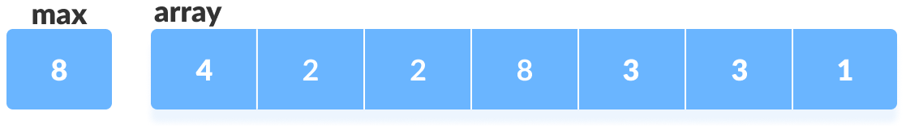
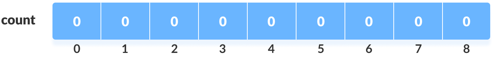
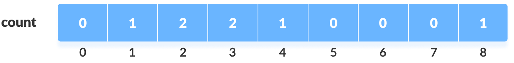
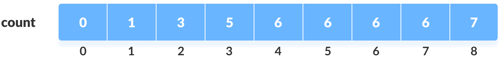
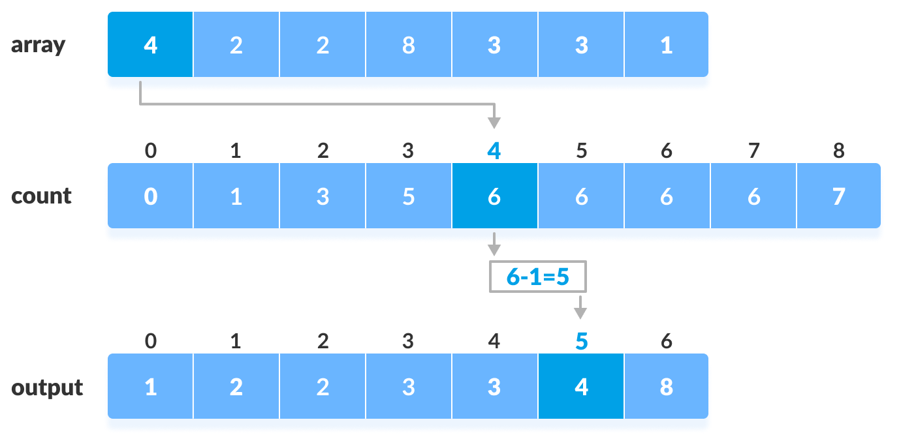
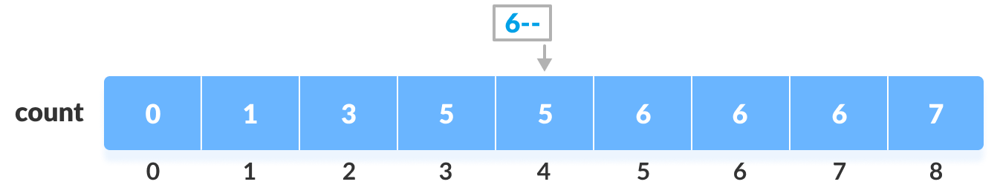

# Counting Sort Algorithm

*Counting sort* is a sorting algorithm for the elements of an array by counting the number of occurrences of each unique element. The count is stored in an *auxiliary* array and the sorting is done by mapping the count as an index of the auxiliary array.

- Linear complexity - `O(n)`
- Space complexity - `O(max)`

**Step-1:** Find out the maximum element (let it be `max`) from the given array.

**Step-2:** Initialize an array of length `max + 1` with all elements `0`. This array is used for storing the count of the elements in the array.

**Step-3:** Store the *count* of each element at their respective index in `count` array

*For example*: if the count of element 3 is 2 then, 2 is stored in the 3rd position of `count` array. If element "5" is not present in the array, then 0 is stored in 5th position.

**Step-4:** Store cumulative sum of the elements of the count array. It helps in placing the elements into the correct index of the sorted array.

**Step-5:** Find the index of each element of the original array in the count array. This gives the cumulative count. Place the element at the index calculated as shown in figure below.

**Step-6:** After placing each element at its correct position, decrease its count by one.

**Step-7:** Do this for the remaining elements of the `array` resulting in the *auxiliary* array `output` containing the sorted list of the same elements.

## Pros and Cons

- There is no comparison between any elements, so it is better than comparison based sorting techniques. But, it is bad if the integers in the input `array` are very large because the array of size `max + 1` will have to be allocated.
- Counting sort is used when:
    - there are smaller integers with multiple counts.
    - linear complexity is the need.
