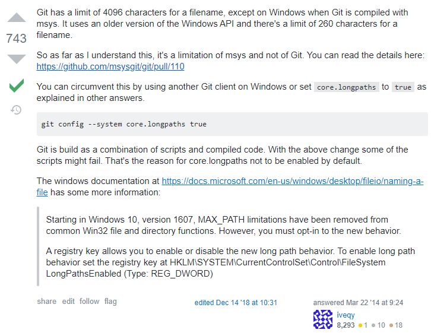

# Git issue(s)
## Git - supporting long filenames on Windows

Config the support of long filenames:

```
$> git config --system core.longpaths true
```

To undo this config:

```
$> git config --system --unset core.longpaths
```

### References:



[Git issue details](https://github.com/msysgit/git/pull/110) \
[Microsoft - Naming Files, Paths, and Namespaces](https://docs.microsoft.com/en-us/windows/desktop/fileio/naming-a-file)

